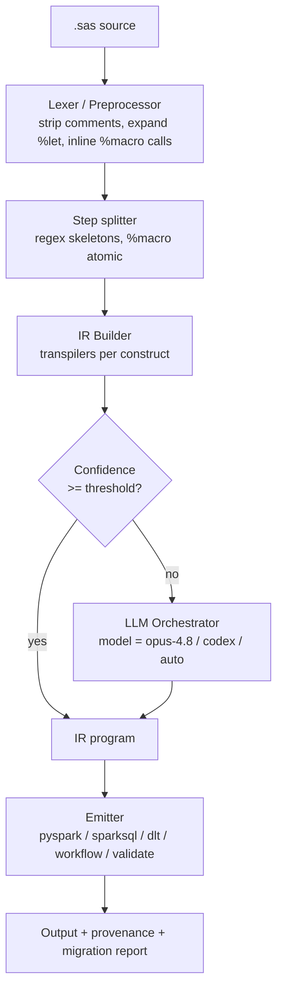

# Architecture

sas2databricks is a **hybrid transpiler**: a deterministic rules-based core plus an
LLM orchestration layer. This document explains the pipeline, the intermediate
representation (IR), and how the three front-ends (CLI, MCP, Copilot agent) share it.

## Design principles

1. **Deterministic first.** Anything we can convert with rules, we do — it is faster,
   free, reproducible, and reviewable. The LLM is a fallback, not the primary path.
2. **One IR to rule them all.** SAS constructs are parsed into an engine-agnostic IR.
   Emitters turn the IR into PySpark, Spark SQL, DLT, or Workflows. Add a target by
   adding an emitter, not by rewriting transpilers.
3. **Provenance everywhere.** Every IR node tracks its source SAS span and how it was
   produced (`rule` vs `llm`) plus a confidence score. Output carries this as comments.
4. **The LLM never runs blind.** When a node is escalated, the orchestrator gives the
   model the surrounding IR, the SAS source, and a strict output contract, then
   validates the result before it is accepted.

## Pipeline

## Stages

### 1. Parser (`parser/`)
- `lexer.py` — preprocessing: strips `/* */` and `*;` comments, normalizes whitespace,
  collects `%let` macro variables and expands `&name` references, captures `%macro`
  definitions and inlines `%name(args)` invocations, then splits the program into
  **steps** (`DATA …; run;`, `PROC …; run/quit;`, `%macro … %mend;` as one atomic step).
- `sas_parser.py` — drives preprocessing + splitting and yields `RawStep` objects plus
  the macro-variable and `%macro` symbol tables. SAS is not cleanly context-free, so
  rather than one grammar we parse statement skeletons with targeted regexes and delegate
  deep expression parsing to construct-specific transpilers (e.g. sqlglot for PROC SQL).

### 2. IR (`ir/__init__.py`)
The IR is a small set of dataclasses:
- `Program` — ordered list of `Step`s + macro/format symbol tables.
- `Step` — one logical unit (`SqlStep`, `DataStep`, `AggStep`, `FormatStep`,
  `ReportStep`, `StatStep`, `ModelStep`, `MacroDef`, `RawStep`).
- Each node carries `Provenance` (source span, engine, confidence, notes).

### 3. Transpilers (`transpilers/`)
One module per SAS construct. Each takes a `RawStep` and returns IR node(s):
- `proc_sql.py` — parses the `SELECT`/`CREATE TABLE` with **sqlglot**, re-emits as
  Spark dialect. High confidence, fully deterministic.
- `data_step.py` — handles `SET`, `MERGE` (→ joins), assignments, `IF/THEN/ELSE`,
  `WHERE`, `KEEP/DROP/RENAME`, `BY` groups, `RETAIN` (→ cumulative window sums),
  `FIRST./LAST.` (→ `row_number()` window flags), and `LAG()/DIF()` (→ `lag()` windows).
  Order-sensitive logic uses a synthetic `_row_id`. Unknown functions escalate to the LLM.
- `macro.py` captures `%MACRO` definitions; `macros.py` (top level) deterministically
  converts the body to a parameterized Python function (Spark SQL) when it lowers cleanly.
- `proc_means.py` — `PROC MEANS/SUMMARY/FREQ/TABULATE` → group-by aggregations.
- `formats.py` — `PROC FORMAT` `VALUE` clauses → mapping tables / `CASE` UDFs.
- `proc_report.py` — `PROC REPORT/PRINT` → notebook display / SQL projection.
- `proc_stats.py` — `PROC CORR/UNIVARIATE` → descriptive-stats helpers; `PROC
  REG/LOGISTIC/GLM/GENMOD` → Spark MLlib estimator scaffolds.

### 4. LLM Orchestrator (`llm/`)
- `models.py` — the `Model` enum (`OPUS_4_8`, `CODEX`, `AUTO`) and the routing policy.
- `orchestrator.py` — accepts low-confidence nodes, builds a prompt with context, calls
  the configured `LLMProvider`, validates and attaches the result. Ships with a
  `CopilotProvider` (delegates to the host Copilot model when run inside VS Code/MCP)
  and a `NullProvider` (emits a `TODO` stub so the deterministic pipeline still runs
  offline).
- `providers.py` — optional real providers: `AnthropicProvider` (Claude/Opus) and
  `AzureOpenAIProvider`, plus `provider_from_env()` to auto-select from env vars.
- `prompts.py` — the conversion / explanation / validation prompt templates.

### 5. Emitters (`emitters/`)
- `pyspark_emitter.py` — IR → PySpark DataFrame code in a Databricks notebook layout.
- `sparksql_emitter.py` — IR → Spark SQL / Databricks SQL.
- `dlt_emitter.py` — IR → Delta Live Tables (`@dlt.table`) with `@dlt.expect` quality
  rules from `WHERE` filters and optional Unity Catalog targeting.
- `workflow_emitter.py` — IR → Databricks Workflows job JSON wiring the steps as tasks.
- `validation_emitter.py` — a SAS-vs-Spark data-parity notebook (row count, schema, and
  per-column checksum diffs against SAS reference exports).

## Front-ends share the same core

| Front-end | Entry point | Model selection |
| --- | --- | --- |
| CLI | `cli.py` (`s2db`) | `--model {opus-4.8,codex,auto}` |
| MCP server | `mcp/server.py` | `model` argument on each tool call |
| Copilot agent | `.github/copilot/agents/sas-migrator.agent.md` | agent model picker |

All three call into `pipeline.py::migrate()`, which runs parse → transpile → (escalate) →
emit and returns a `MigrationResult` (generated files + a migration report with per-step
provenance, confidence, and manual-review flags).

## Confidence & review model

Each step gets a confidence in `[0,1]`. Steps below `--confidence-threshold` (default
`0.8`) are either escalated to the LLM (if a provider is configured) or emitted as a
clearly marked `# MANUAL REVIEW` stub. The migration report aggregates these so a human
knows exactly where to look.
