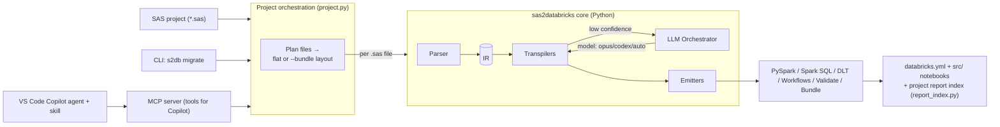

# sas2databricks 🦶

### `sas2databricks` - track down your SAS and set it free in the Databricks lakehouse.

**An open-source, LLM-assisted migration toolkit that converts SAS analytics, data
transformations, and reports into Databricks (PySpark, Spark SQL, Delta Live Tables,
and Workflows) - end to end.**

> Deterministic transpilers handle the patterns we understand. A GitHub Copilot-powered
> LLM layer (default **Claude Opus 4.8**, or **Codex**, or **Auto**) fills the gaps,
> resolves ambiguity, and explains every conversion.

[](https://pypi.org/project/sas2databricks/)
[](LICENSE)
[](pyproject.toml)
[](ROADMAP.md)

---

## Why this exists

Migrating SAS to Databricks is hard because SAS is not one language - it is a family of
sub-languages (DATA step, PROC SQL, the macro facility, dozens of PROCs, formats/informats).
Pure rules-based converters break on real-world code; pure LLM converters hallucinate and
are unverifiable. **sas2databricks combines both**:

1. A **deterministic core** parses SAS into an intermediate representation (IR) and
   transpiles every pattern it recognizes - fast, free, and 100% reproducible.
2. An **LLM orchestrator** is invoked only for the residue (unknown PROCs, gnarly macros,
   business logic) with the model you choose, and its output is validated against the IR.
3. Every line of generated code carries **provenance** (which SAS line it came from and
   whether it was rule-based or LLM-based) so reviewers can trust the result.

## What it covers

| SAS capability | Target | Engine |
| --- | --- | --- |
| `PROC SQL` | Spark SQL / PySpark | Deterministic (sqlglot) |
| `DATA` step (BY-group, `RETAIN`, arrays + `DO` loops, `LAG`, `FIRST.`/`LAST.`) | PySpark | Deterministic + LLM |
| Macro facility (`%MACRO`, `%LET`, `%IF/%DO/%ELSE`, iterative `%DO`, macro vars) | Python/Jinja params | Deterministic |
| `PROC MEANS` / `SUMMARY` / `FREQ` / `TABULATE` (measures & aggregations) | PySpark / Spark SQL | Deterministic |
| `PROC FORMAT` (formats/informats) | PySpark UDF / mapping tables | Deterministic |
| `PROC REPORT` / `PRINT` | Databricks notebook viz / SQL | Deterministic + LLM |
| Statistical PROCs (`REG`, `LOGISTIC`, `GLM`, `GENMOD`) | Spark MLlib scaffold | Deterministic (review) |
| Descriptive PROCs (`CORR`, `UNIVARIATE`) | Spark stats helpers | Deterministic |
| Data-parity validation | `validate` notebook (row/schema/checksum diff) | Deterministic |
| Deployment packaging | Databricks Asset Bundle (`databricks.yml`) + Workflows job graph | Deterministic |

## Three ways to use it



1. **CLI** - `s2db migrate ./sas_project --target pyspark --out ./databricks` for batch jobs.
2. **MCP server** - exposes `parse_sas`, `convert_sas`, `validate_conversion`,
   `explain_conversion`, `migrate_project` as tools to any MCP client (incl. GitHub Copilot).
3. **VS Code Copilot agent + skill** - the `@sas-migrator` agent orchestrates the migration
   interactively and lets you pick the model (Opus 4.8 default / Codex / Auto).

## Quick start

```bash
# Install from PyPI
pip install sas2databricks
#   ...or include the MCP server extra:
pip install "sas2databricks[mcp]"

# Convert a single SAS program to PySpark
s2db convert examples/sample1_proc_sql.sas --target pyspark

# Migrate an entire SAS project, choosing the LLM model for the gaps
s2db migrate ./examples --target dlt --model opus-4.8 --out ./out

# Assemble a deployable Databricks Asset Bundle (databricks.yml + src/ notebooks + reports/)
s2db migrate ./examples --target pyspark --bundle --html --out ./bundle
#   then:  cd bundle && databricks bundle deploy -t dev

# Run the MCP server (stdio) so Copilot can call the tools
s2db mcp
```

> **From source (for development):** `git clone https://github.com/navintkr/sas2databricks`
> then `pip install -e ".[dev,mcp]"`. The `examples/` SAS samples used above live in the repo.

## Model selection

The LLM layer is **provider-agnostic**. Pick the model per run:

| Value | Meaning |
| --- | --- |
| `opus-4.8` | **Default.** Best reasoning for complex macros & business logic. |
| `codex` | Fast, code-focused conversions. |
| `auto` | Router: deterministic first; escalates only low-confidence nodes, and picks Opus for macros/business logic, Codex for mechanical rewrites. |

In the VS Code Copilot agent the model is selected via the agent's model picker; in the CLI
and MCP server it is the `--model` flag / `model` argument. See [docs/model-selection.md](docs/model-selection.md).

## Project layout

```
src/sas2databricks/
├── parser/        # SAS → preprocess → macro expansion → step split
├── ir/            # Intermediate representation (engine-agnostic)
├── transpilers/   # IR builders per SAS construct (deterministic)
├── emitters/      # IR → PySpark / Spark SQL / DLT / Workflows / Validate / Bundle
├── llm/           # Model selection + orchestrator + pluggable providers
├── macros.py      # %MACRO body (+ %IF/%DO control flow) → parameterized Python function
├── mcp/           # MCP server exposing the core as tools
├── project.py     # Project migration: flat or deployable-bundle layout
├── report_index.py# Project-level report index (Markdown + HTML)
├── pipeline.py    # End-to-end orchestration
└── cli.py         # `s2db` command-line interface
```

See [ARCHITECTURE.md](ARCHITECTURE.md) for the full design and [ROADMAP.md](ROADMAP.md)
for what's planned.

## Status

**v0.3.0 - real and growing.** Deterministic transpilers (with tests) cover PROC SQL,
macro variables, **`%MACRO` definitions/invocations with `%IF`/`%DO`/`%ELSE` control flow
and iterative `%DO` loops**, PROC MEANS/FORMAT/REPORT, the DATA step (BY-group, `RETAIN`,
`LAG`/`DIF`, `FIRST.`/`LAST.`, `MERGE`, **arrays + iterative `DO` loops**), descriptive
stats (`CORR`/`UNIVARIATE`), and MLlib scaffolds for `REG`/`LOGISTIC`/`GLM`. Targets include
PySpark, Spark SQL, DLT (with expectations), Workflows, a data-parity `validate` notebook,
and a **Databricks Asset Bundle** (`databricks.yml`). `s2db migrate --bundle` assembles a
deployable bundle (notebooks + `databricks.yml` + a roll-up **project report index**). Real
LLM providers (Anthropic, Azure OpenAI) plug in behind `LLMProvider`, results render to an
HTML report, and CI runs ruff + mypy + pytest on Python 3.10–3.12. Contributions welcome -
see [CONTRIBUTING.md](CONTRIBUTING.md).

## License

MIT © contributors. SAS and all related marks are trademarks of SAS Institute Inc.
This project is independent and not affiliated with or endorsed by SAS Institute Inc.
